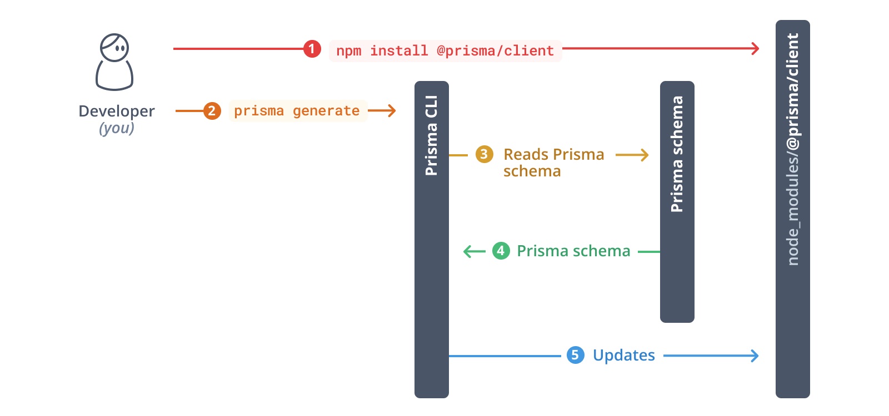

## СКРИПТЫ PRISMA.IO

Во время разработки необходимо удалять таблицы из БД, а затем запускать
команду
```bash
npm run prisma:db:dev
```

Эта команда создаст таблицы БД и заполнит базу тестовыми данными


Генерация клиента:
```bash
npm run prisma:generate
```
This command reads your Prisma schema and generates your Prisma Client library:



Документация по следующим командам:
https://www.prisma.io/docs/getting-started/setup-prisma/add-to-existing-project/relational-databases/baseline-your-database-typescript-postgresql

Инициализация начальной миграции:

```bash
npm run prisma:migrate:diff
```

Применение изменений к БД с внесением в таблицу миграции:

```bash
npm run prisma:migrate:resolve
```